# Zoom Clone

A video meeting web app that copies the Zoom web client. You can start a meeting, join by ID or link, schedule a meeting, and talk with audio and video. A host can mute and remove people.

Built for the Scaler SDE Fullstack assignment. The brief is in `ASSIGNMENT.pdf`.

## Screenshots

| Sign in | Dashboard |
|---|---|
| 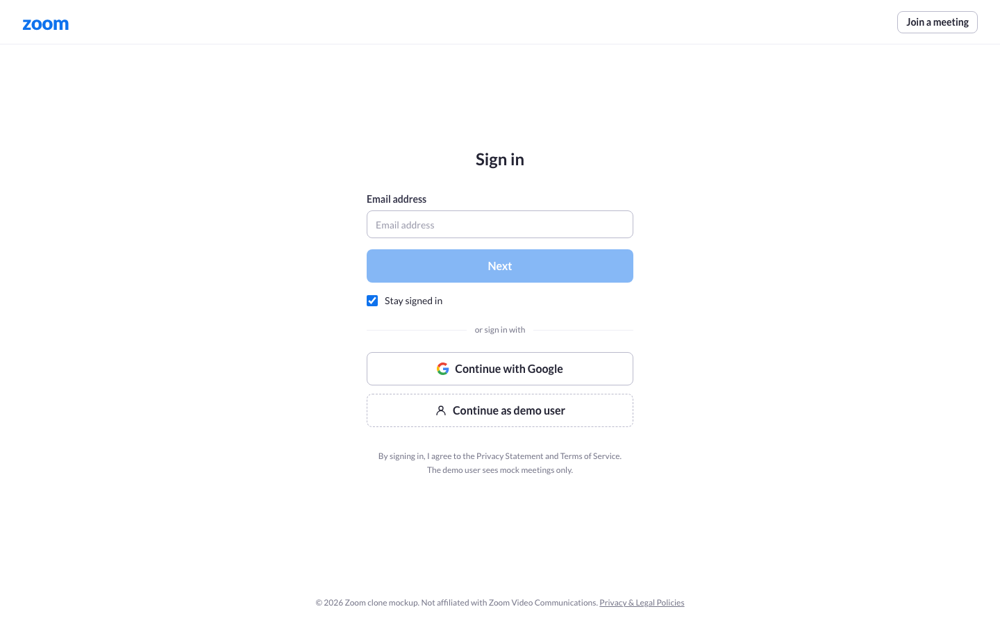 | 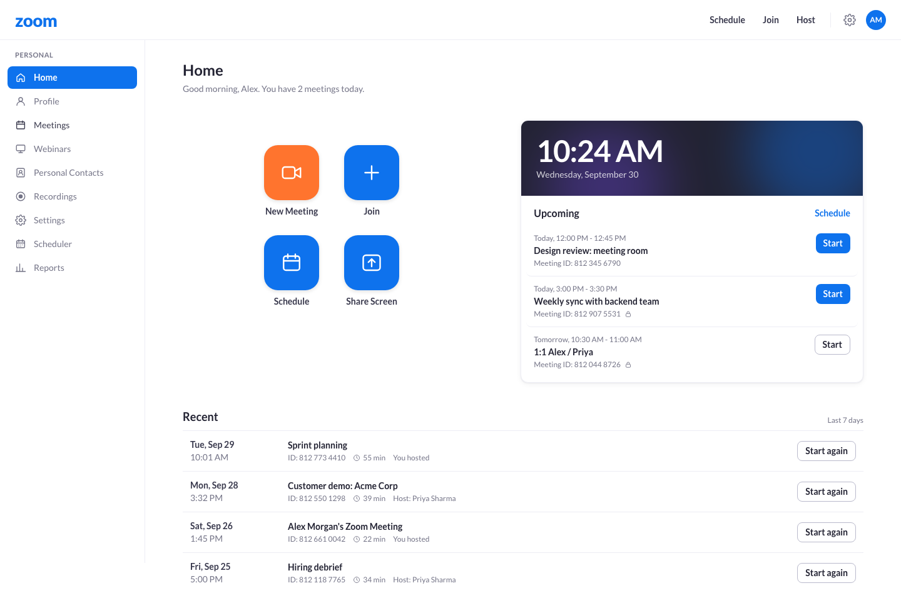 |

| Join | Schedule |
|---|---|
| 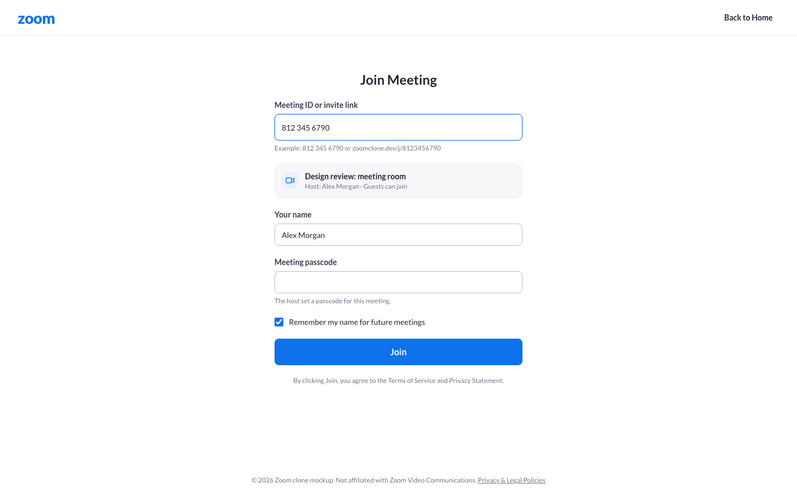 | 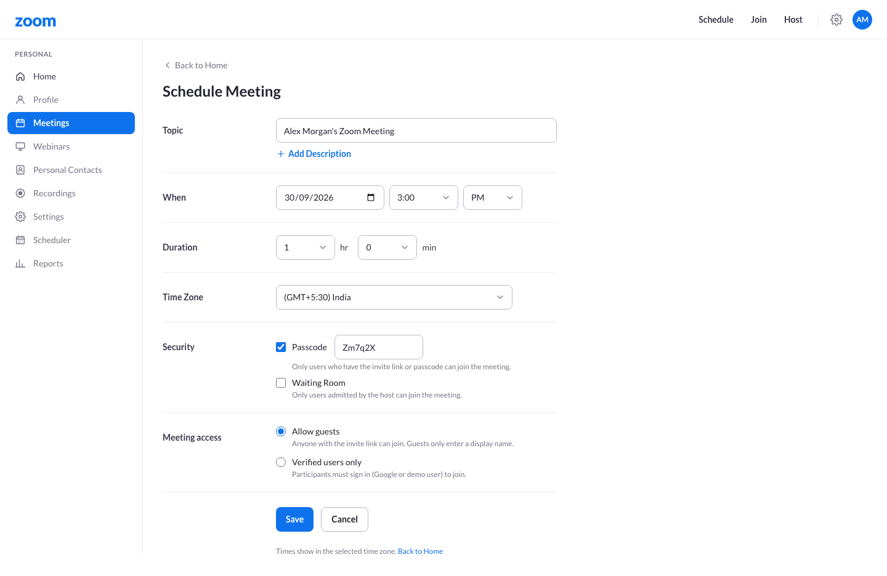 |

| Pre-join preview | Meeting room |
|---|---|
| 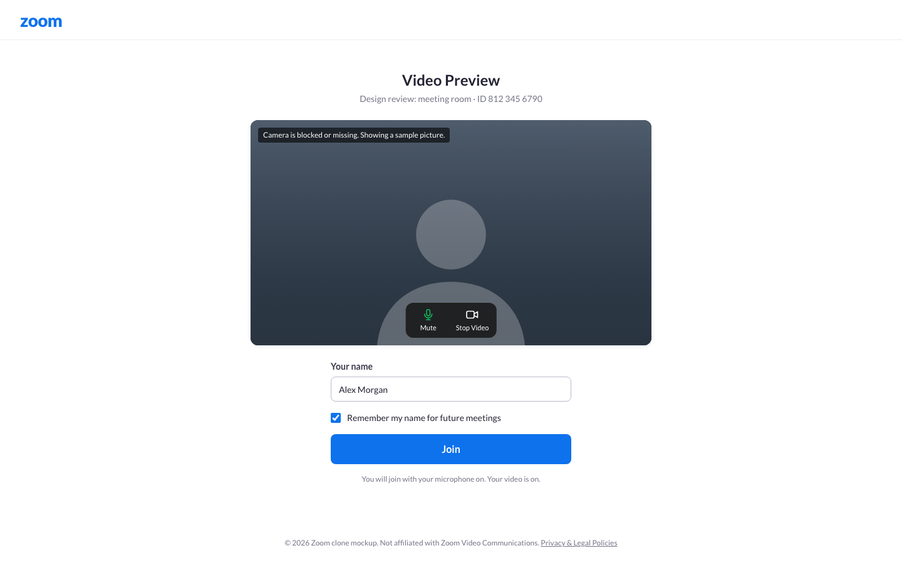 | 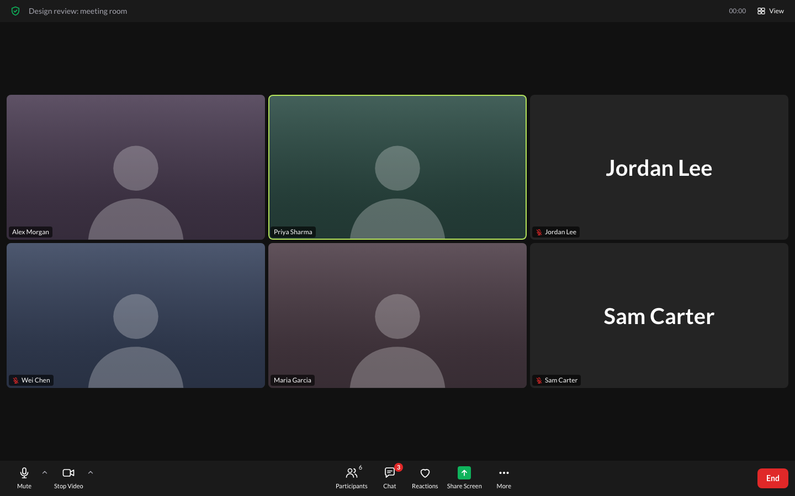 |

| Participants panel | Dashboard on a phone |
|---|---|
| 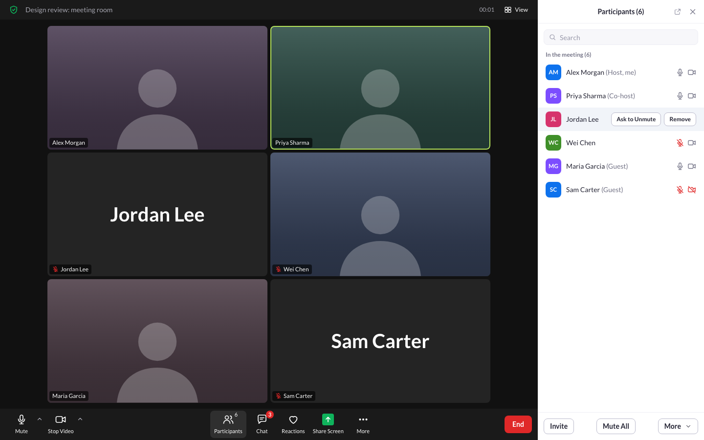 | 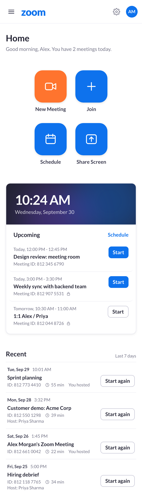 |

Live app screens from the build stages:

| Four-way call | Host controls | Six people |
|---|---|---|
| 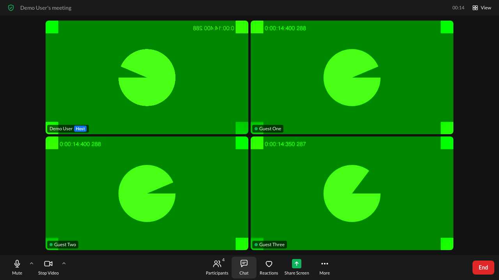 | 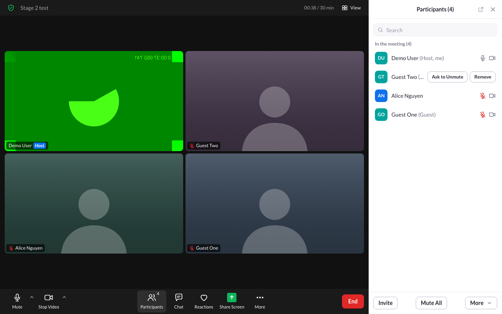 | 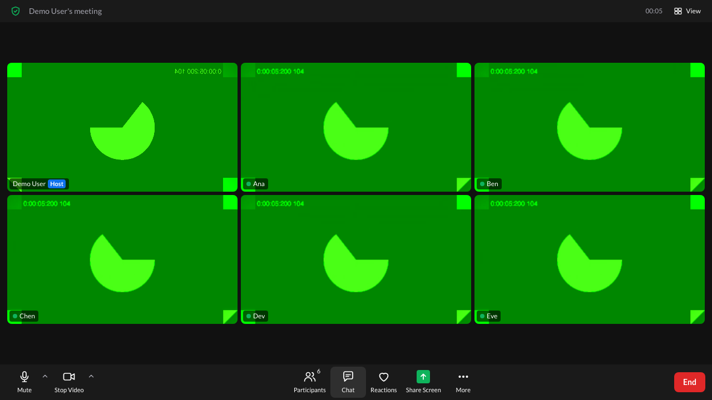 |

## Features and the assignment

| Assignment item | Where it is |
|---|---|
| Landing dashboard: navbar, New, Join, Schedule, Upcoming, Recent | `/` |
| Instant meeting: unique ID, invite link, go to the room | New Meeting button, `POST /api/meetings/instant` |
| Join by ID or invite link, display name, check the meeting exists | `/join` and `/j/{code}` |
| Schedule: title, description, date and time, duration, link, stored, shown in Upcoming | `/schedule`, `POST /api/meetings` |
| Sample data | `app/seed.py` |
| Responsive design (bonus) | Phone, tablet and desktop layouts |
| User authentication (bonus) | Google sign-in, plus a demo user |
| Host controls (bonus) | Mute, mute all, remove, end meeting |
| Extra: live audio and video | WebRTC mesh, signaling on a WebSocket |
| Extra: passcode and access setting | `passcode`, `verified_only` or `allow_guests` |
| Extra: reconnect | `rejoin_token` and socket reconnect |

## Tech stack

- Frontend: Next.js 16 (App Router), React 19, TypeScript, Tailwind 4, SWR.
- Backend: FastAPI, SQLAlchemy 2.0, Alembic, Pydantic v2, authlib.
- Database: SQLite.
- Realtime: FastAPI WebSocket for events and signaling. WebRTC for media.
- Deploy: Vercel (frontend), Render (backend, Docker).
- Tools: uv, ruff, pytest, Vitest, ESLint, GitHub Actions.

## Architecture

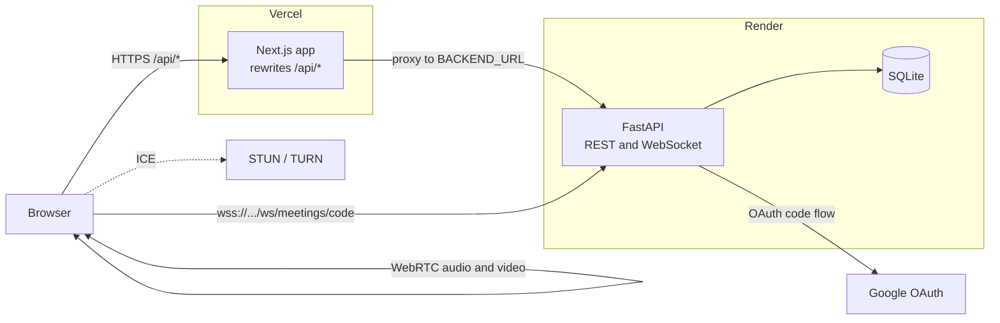

Key points:

- The browser calls `/api/*` on the Vercel origin. Next.js `rewrites` forward the call to `BACKEND_URL`. The `session` cookie is first-party.
- Vercel cannot proxy WebSockets. The browser connects to Render directly with `NEXT_PUBLIC_WS_URL`.
- The WebSocket uses a short-lived ticket in the URL, not a cookie.
- Routers are thin. Business rules are in `backend/app/services/`.

More detail is in `docs/architecture.md`.

## Database schema

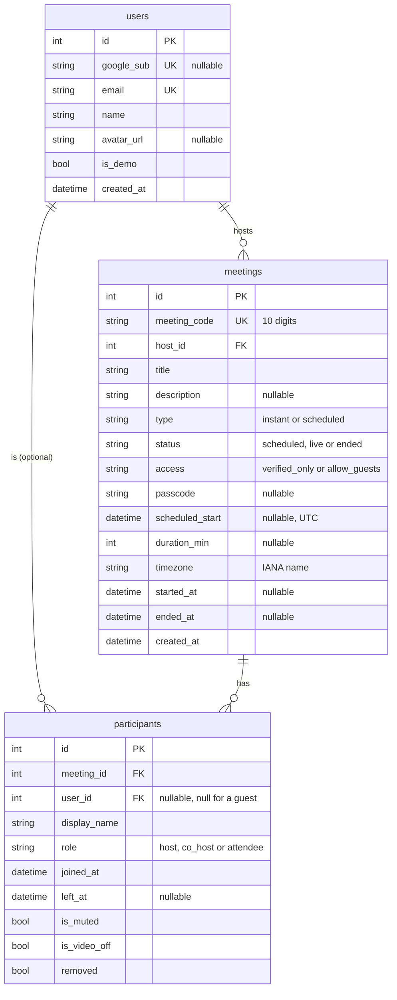

### Tables

- `users`: one row per signed-in person. `google_sub` is null for the demo user. `is_demo` marks the seeded demo account.
- `meetings`: one row per meeting, instant or scheduled. `host_id` points to `users`. `meeting_code` is the public ID.
- `participants`: one row per person per meeting. A guest has no `user_id`. This table is the attendance history.

### Design choices

- Public ID and primary key are separate. `meeting_code` is a random 10-digit number with a unique index. The service retries on a collision. The integer `id` stays internal.
- Guests are rows, not users. A guest joins with a name only. This keeps `users` clean and still lets us list who joined.
- `removed` and `left_at` are flags, not deletes. The host can remove a person, and the history stays.
- Times are stored in UTC. `timezone` keeps the host's zone for display only.
- `status` and `access` are separate. `status` is the life cycle. `access` is the join rule.
- A scheduled meeting that nobody started keeps `status=scheduled`. The API uses `scheduled_start + duration_min` to decide if it is Upcoming or Recent. No cron job is needed.
- Indexes: `meeting_code` (unique), `(host_id, scheduled_start)` for the dashboard, and `participants.meeting_id` for the room.

## API overview

Base path `/api`. Error body: `{"detail": "...", "code": "..."}`.

| Area | Routes |
|---|---|
| Auth | `GET /auth/google/login`, `GET /auth/google/callback`, `POST /auth/demo`, `POST /auth/logout`, `GET /me` |
| Meetings | `POST /meetings/instant`, `POST /meetings`, `GET /meetings/upcoming`, `GET /meetings/recent`, `GET /meetings/{code}`, `PATCH` and `DELETE /meetings/{id}`, `POST /meetings/{code}/join`, `POST /meetings/{code}/end` |
| Participants | `GET /meetings/{code}/participants`, `POST .../participants/{pid}/mute`, `POST .../mute-all`, `POST .../participants/{pid}/remove` |
| Health | `GET /health` |
| WebSocket | `/ws/meetings/{code}?ticket=...` |

The full contract, with error codes and WebSocket events, is in [docs/api.md](docs/api.md).

## Realtime and WebRTC

- The WebSocket carries participant state: join, leave, mute, video toggle, remove, end.
- It also relays WebRTC signaling (`offer`, `answer`, `ice`). The server never reads the signal data.
- Media goes from browser to browser. No media passes through the server.
- Topology is a mesh. Each person keeps one connection to every other person. This works well for 2 to 6 people. The load grows with each person, because each browser sends one copy of its video to each peer.
- STUN is `stun:stun.l.google.com:19302`. It helps browsers find their public address.
- STUN is not enough on strict NATs and some company networks. Those need a TURN server that relays the media. The app reads an optional TURN server from `NEXT_PUBLIC_TURN_URL`, `NEXT_PUBLIC_TURN_USERNAME` and `NEXT_PUBLIC_TURN_CREDENTIAL`. If they are empty, the app uses STUN only. These values go into the browser bundle, so use a TURN account with limits.
- The design is in [docs/webrtc-plan.md](docs/webrtc-plan.md).

## Auth design

- Google OAuth 2.0, authorization code flow. FastAPI runs it with authlib. Scopes: `openid email profile`.
- The callback URL is `<FRONTEND_ORIGIN>/api/auth/google/callback`. It is built from the Vercel origin, so the browser stays on one origin.
- FastAPI makes its own JWT. It sets it in an httpOnly, `SameSite=Lax` cookie named `session`. The cookie has the `Secure` flag in production.
- Demo user: `POST /api/auth/demo` signs in the seeded user `demo@zoomclone.test`. It works only if `ENABLE_DEMO_LOGIN=true`. Evaluators can use the app without a Google account.
- Guest access setting: each meeting has `access`. With `allow_guests` (the default), a guest joins with a name. With `verified_only`, only signed-in users can join.
- A passcode is optional. The host does not need it.
- CORS and the WebSocket accept only `FRONTEND_ORIGIN`.

## Run it on your machine

You need [uv](https://docs.astral.sh/uv/), Node 20 or later, and Git.

### Backend

Run these in `backend/`.

1. Install the packages: `uv sync`
2. Create the env file: `cp .env.example .env`
3. Keep `ENABLE_DEMO_LOGIN=true`. Leave the Google values empty if you do not need Google.
4. Create the tables: `uv run alembic upgrade head`
5. Add sample data: `uv run python -m app.seed`
6. Start the server: `uv run uvicorn app.main:app --port 8000`

The API is at http://localhost:8000. The interactive docs are at http://localhost:8000/docs.

### Frontend

Run these in `frontend/`.

1. Install the packages: `npm install`
2. Create the env file: `cp .env.example .env.local`
3. Start the app: `npm run dev`
4. Open http://localhost:3000 and click "Continue as demo user".

To test with two people, open a second browser or a private window and join by the meeting ID.

## Tests and CI

Backend (in `backend/`):

```
uv run pytest
uv run ruff check .
uv run ruff format --check .
```

Frontend (in `frontend/`):

```
npm run lint
npm test
npm run build
```

The backend tests use an in-memory SQLite database. They need no `.env` file.

GitHub Actions runs both sets on every pull request and on every push to `main`. See `.github/workflows/ci.yml`.

## Deploy

Short version. The full click-by-click steps and the env var tables are in [docs/deploy.md](docs/deploy.md).

1. Render: create the backend from `render.yaml`. Free plan, Docker. Note the URL, for example `https://zoom-clone-api.onrender.com`.
2. Vercel: import the repo. Set the project root to `frontend/`. Set `BACKEND_URL` to the Render URL and `NEXT_PUBLIC_WS_URL` to the same host with `wss://`. Set both before the first build.
3. Render: set `FRONTEND_ORIGIN` to the Vercel URL. Deploy again.
4. Google Cloud Console: add this redirect URI to the OAuth client: `https://<your-vercel-domain>/api/auth/google/callback`.

Why set the Vercel variables before the first build: `frontend/next.config.ts` reads `BACKEND_URL` when Next.js builds. The value goes into the rewrite rule in the build output. `NEXT_PUBLIC_WS_URL` goes into the browser bundle. If you set either one after a build, you must redeploy.

Free Render has no persistent disk. SQLite lives inside the container. Every deploy and every restart makes a new container, so the data resets. On start, `backend/start.sh` runs the migrations and seeds the demo data again.

## Assumptions

- The reviewer signs in with the demo user. Google sign-in is an extra.
- One backend process. The WebSocket rooms and the used-ticket list are in memory.
- Meeting codes are 10 digits. A join accepts them with or without spaces.
- An unstarted scheduled meeting stays in Upcoming until `scheduled_start + duration_min`. The default duration is 15 minutes.
- Meeting rooms are small, 2 to 6 people.
- The UI copies the Zoom web client layout and behavior. It does not use Zoom assets.

## Known limitations

- Free Render sleeps after about 15 minutes with no traffic. The first request after that takes about a minute.
- SQLite resets on every deploy and restart on free Render. Users, meetings and history are lost.
- The mesh works for about 6 people. More people cause high CPU and bandwidth use in each browser.
- No TURN server is set up by default. Some networks cannot connect.
- Chat is not built, so nothing is stored for chat.
- No screen share.
- No recording.
- No horizontal scaling. Rooms live in one process.

## How the work was split

- The lead set the design: stack, API contract, schema and WebRTC plan (`docs/`).
- Each task was one branch and one pull request. It had one owner and one reviewer.
- Order: backend API, design (Design A), frontend stage 1 (dashboard, join, schedule), stage 2 (live room, host controls), stage 3 (audio and video), then deploy and QA.
- The reviewer read every pull request, ran the tests and merged it.
- Rules for the work are in `CLAUDE.md`.
